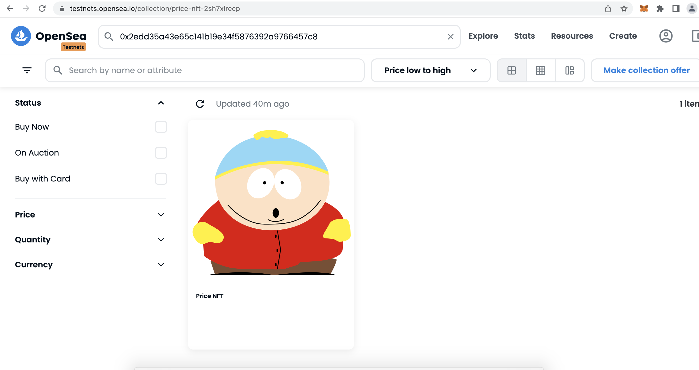

# NFT MINTING

## SUMMARY

In this project. I mint 3 NFT's

 - Basic NFT
 - Random IPFS NFT - Create scarcity of NFT collection
 - Dynamic SVG NFT - Image changes with parameters

 ***

## SETUP

Once you download repo, here are things you need to do:

1. Create a Chainlink subscription Id to access Verfied Random Number service. Go to [Chainlink app](https://vrf.chain.link/) and create a subscription. If you are running on testnet, make sure you get test LINK tokens and fund the subscription by adding funds. Go to [Chainlink faucet](https://faucets.chain.link/rinkeby) to get test LINK and ETH.

2. Setup your .env file. Project has [env.example](env.example) attached. Add your Metamask private key, and API keys for Alchemy/infura nodes etc. 

3. Code is tested on `Rinkeby` network. If you are using other networks, make sure config properties in [hardhat.config.ts](./hardhat.config.ts) and [helper-hardhat-config.ts](./helper-hardhat-config.ts) are properly setup. All config variables defined in `rinkeby` should also be present in network you are running

4. Run test cases to make sure all test cases are passing

```
$ yarn hardhat test
```

To run a specific test, you can do
```
$ yarn hardhat test --grep <test name>
```

5. Deploy all contracts. Check 'Deployments' section for more details

6. Mint NFT once all deployments are done. Check 'Mint NFT' section for more details

7. Once minted, paste the contract address in OpenSea and you should be good to go!

***

 ## CONTRACTS


 **Basic NFT**

 [Basic NFT contract](./contracts/BasicNFT.sol) is extended for [ERC721 contract](https://github.com/OpenZeppelin/openzeppelin-contracts/blob/master/contracts/token/ERC721/ERC721.sol) of OpenZeppelin. In this contract, we define `mint()` function and update the `tokenId` that is unique for every NFT that is minted 

**Randomized NFT** 

[Randomized NFT contract](./contracts/RandomizedNFT.sol) is extended from [ERC721 contract](https://github.com/OpenZeppelin/openzeppelin-contracts/blob/master/contracts/token/ERC721/ERC721.sol), [Ownable contract](https://github.com/OpenZeppelin/openzeppelin-contracts/blob/master/contracts/access/Ownable.sol) and [VRFConsumerBaseV2](https://github.com/smartcontractkit/chainlink/blob/develop/contracts/src/v0.8/VRFConsumerBaseV2.sol). 

VRFConsumerBaseV2 is a chain link contract that gives us a verifiable random number. We generate a random number & based on this value, we mint one of 3 NFT's. In this contract, I also demonstrate the concept of scarcity - based on random number, we generate scarcity effect where some Nft's get minted rarely while others are more frequent.

**Dynamic NFT**

[Dynamic NFT contract](./contracts/DynamicNFT.sol) uses SVGs to mint dynamic NFT's based on prevailing ETH price. mintNFT function expects an initial value & if input value > ETH price, high value NFT is minted and vice versa. This contract is extended from ERC721 again

***

 ## DEPLOYMENTS

 There are  4 files that will deploy in that order

1. [00-deployMocks.ts](./deploy/00-deployMocks.ts) deploys price and random number generator mocks
2. [01-deployNFT.ts](./deploy/01-deployNFT.ts) deploys a basic NFT contract with a hardcoded 'ipfs' image location
3. [02-deployRandomizedNFT.ts](./deploy/02-deployRandomizedNFT.ts) deploys randomized NFT contract with a set of tokenURIs. 

TokenURI array are currently hardcoded in the same file - to generate your own set of TokenURI's, follow steps below

- Create a free account in [Pinata](https://app.pinata.cloud/pinmanager)
- Register a API Key and enter `key` and `secret` in your `.env` file
- Copy your images to `images` folder
- Set the flag `UPLOAD_TO_PINATA` to `true`
- run the following command in terminal

```
$ yarn hardhat deploy --tags randomipfs
```

- Once done, check your pinata dashboard to confirm that images are uploaded
- Copy the `ipfs` links into the tokenURI array - you can now set `UPLOAD_TO_PINATA` to `false`


You also need to setup a subscription with ChainLink for accessing their Verified Random Number (VRF) service. Refer to the Setup section for more on this.

Once contract is deployed, go to [Chainlink Subscription Panel](https://vrf.chain.link/) and `Add Consumer`. Consumer in this case is the contract address that is using Chainlink VRF Service - so you need to add address of `RandomizedNFT` contract created on testnet (you don't need to do this for local network as it is already handled in code)

4. [04-deployDynamicNFT.ts](./deploy/03-deployDynamicNFT.ts) deploys dynamic NFT contract with a set of tokenURIs. You can change the `svg` images for your high/low svg (refer lines 30/31 where they are being set)


Deploy all the contracts by following

Hardhat (local) Network

```
$ yarn hardhat deploy --tags main
```

Rinkeby Network
```
$ yarn hardhat deploy --tags main --network rinkeby
```

On rinkeby network, make sure you verify contracts on [Rinkeby Etherscan](https://rinkeby.etherscan.io/). You can find the contract addresses published in the console.

***

 ## TEST

 You will find unit tests for each contract in `test->unit` folder. I have written tests for major functions. To check code coverage, do

 ```
    $ yarn hardhat coverage
 ```

You can add more tests if you choose to. You can also add a integration test (not written currently)

***

 ## MINT NFTs

 Once you deployed all contracts, you can run the `minNFT` script inside `scripts` folder

Mint on hardhat(local) network

 ```
    $ yarn hardhat run scripts/minNFT
 ```

Mint on rinkeby network

```
    $ yarn hardhat run scripts/minNFT --network rinkeby
```


Once NFT's are minted, select the contract address and paste in [Opensea Testnet](https://testnets.opensea.io/) as follows. You should see your minted NFT here (note that sometimes OpenSea testnet might take some time to register contract - if you don't immeldiately see, try in a few minutes)


